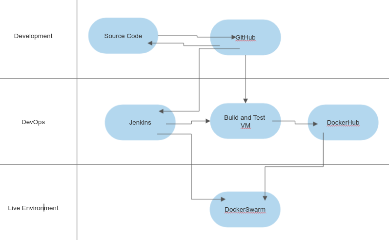
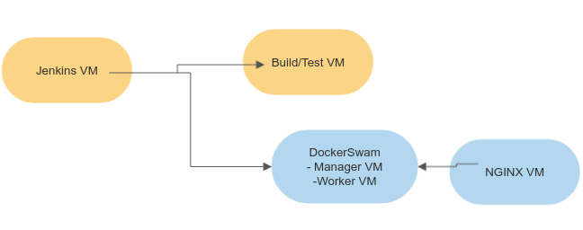
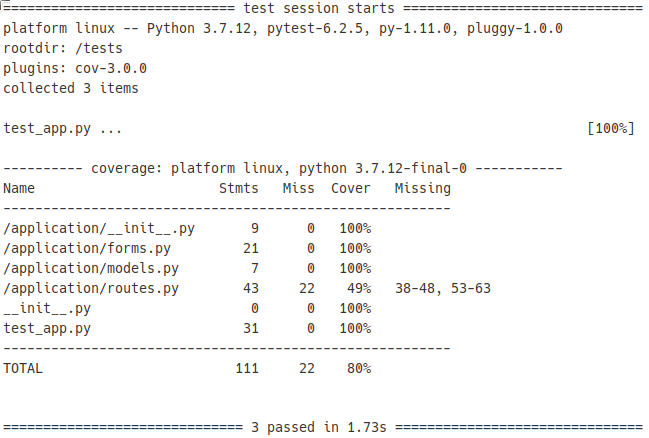

# Exoplanet Web-App

## The application

This application is built in the Python-based microservice framework Flask. Data is stored in a MySQL database.

The app keeps data on exoplanets and is accessible through a web browser. The app has CRUD functionality. The navigation bar allows a user to access the "Enter Data" page where new data can be added. It also allows access to the "Delete" page where data can be deleted by entering the `id` of a record. The index page reads the data currently in the database and displays it on the screen. Update functionality is accessed by visiting the page `http://[ip-address]/update/id`. Updating a particular record is possible by supplying the id and then entering the changes.

Entity-relationship diagram for the database:
|     |        | Exoplanet |                     |
| --- | ------ | --------- | ------------------- |
|     | **pk** | **id**    | **int**             |
|     |        | name      | varchar(32), Unqiue |
|     |        | system    | varchar(32)         |
|     |        | method    | varchar(32)         |
|     |        | year      | int                 |

The frontend of the application is provided by HTML templates to allow the CRUD functionalities with information contained within the database. The backed of the application uses a MySQL database that is integrated using `SQLALchemy` within Flask. Testing is carried out using the `pytest` module.

The application is containerised using Docker and Docker Compose and is deployed to a Docker Swarm - consisting of one manager and one worker node. The app and database are in separate containers and interface with each other.

The application is accessed through NGINX which acts as a reverse-proxy and load balancer.

## The Pipeline

A CI/CD pipeline is created in Jenkins and automates the integration and deployment of new code.

Jenkins sits in its own VM, and the pipeline is triggered by a webhook. The webhook currently activates when changes are pushed or pulled to the develop branch.

After being triggered by the webhook the pipeline integrates changes to a separate test and build VM. Jenkins communicates with the VM using the Publish over SSH extension. It first commands the VM to pull changes from GitHub, and provides environment variables of secrets needed to run a docker-compose file. The images for the containers are then built by docker-compose which uses Dockerfiles for the app and the database. The containers are updated with these images, and then testing is carried out. Then the new images are tagged with the Jenkins build number and pushed to DockerHub.

The next stage of the Pipeline deploys to DockerSwarm manager VM. Jenkins uses the Publish over SSH extension to command the VM. It pulls images from DockerHub and then updates the service running on the nodes in the. The changes are then reflected in the web app.

Pipeline Diagram:

Cloud Infrastructure diagram:

## Unit Tests Report
Here is an image of the test reports for build 136 of the pipline.

## Improvements

Here are a list of improvements:

* Make the update page accessible through the navigation bar.
* Store data for the database in a separate VM.
* Include scientifically useful data on exoplanets to make interesting comparisons. Including sorting and searching functionality, and additional schema.
* Improve the UI of the app.
* The Publish over SSH extension has a complicated syntax. It is possible the set up nodes in Jenkins without the extension and the syntax with this method is simpler.